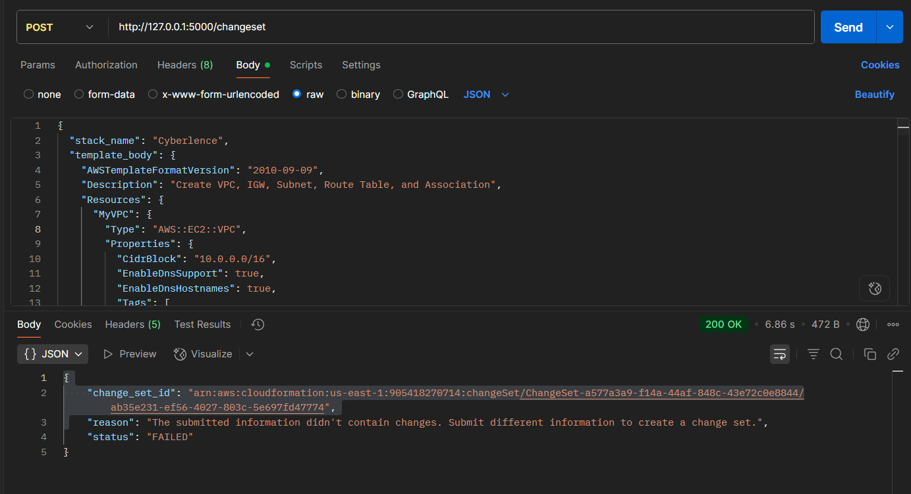
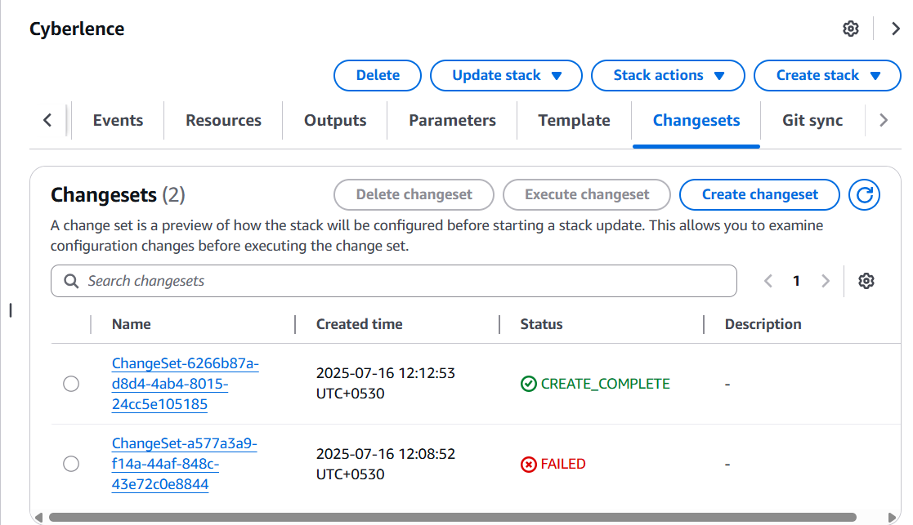

# Cloudformation-template-management

This has been made as part of an assignment by Cyberlence for Intern role. It contains a flask app, which has 3 endpoints to get Cloudformation template, change subnet from public to private and to create changesets.
## Getting Started

### Prerequisites

- Python 3.8+
- `pip` (Python package manager)

### Installation

1. Clone the repository:

    ```bash
    git clone git@github.com:scoder17/cloudformation-template-management.git
    cd cloudformation-template-management
    ```

2. Create a virtual environment and activate it:

    ```bash
    python -m venv venv
    source venv/bin/activate  # On Windows use `venv\Scripts\activate`
    ```

3. Install dependencies:

    ```bash
    pip install -r requirements.txt
    ```

### Running the App

You can run the Flask development server using:

```bash
python app.py
```

### Implemented steps

- I first spinned up a cloud sandbox.
- Added access key id and secret access key through

```
aws configure
```

- Wrote a template json.
- Went to CloudFormation, created a new stack with name Cyberlence.
- Wrote the required flask app.
- Tested the endpoints using Postman after running the server.

## Endpoints

### **GET /template/\<stack_name>**

This endpoint takes the stack_name as parameter and then returns the Template Body json.

### Response Screenshot


### **PUT /template/private/\<subnet_name>**

This endpoint takes the template json and converts the subnet from public to private. You can provide json using Body->raw in Postman. It returns the modified template Json as response.

Sample for Body->raw:

```
{
    "AWSTemplateFormatVersion": "2010-09-09",
    "Description": "Create VPC, IGW, Subnet, Route Table, and Association",
    "Outputs": {
        "InternetGatewayId": {
            "Description": "IGW ID",
            "Value": {
                "Ref": "MyInternetGateway"
            }
        },
        "Route
        .
        .

        .
}
```

### Response Screenshot

You can check the response here: https://gist.github.com/scoder17/ad59c40b360e742b100db56721d02c04


**VPC with original template:**


**VPC with converted template:**


### **POST /changeset**

It accepts stack name and template JSON. It creates a changeset using boto3. It waits for ChangeSet creation and then returns the details.

Sample for Body->raw:

```
{
  "stack_name": "Cyberlence",
  "template_body": {
    "AWSTemplateFormatVersion": "2010-09-09",
    "Description": "Create VPC, IGW, Subnet, Route Table, and Association",
    "Resources": {
      "MyVPC": {
        "Type": "AWS::EC2::VPC",
        .
        .
        .

        ......
}
```

### Response Screenshot

When same JSON template was provided



When Name of the subnet was changed in JSON


